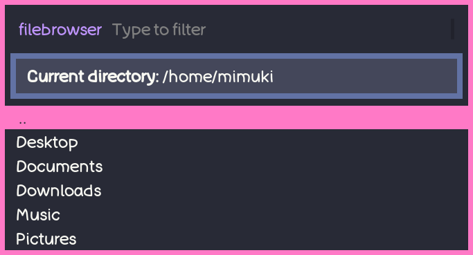
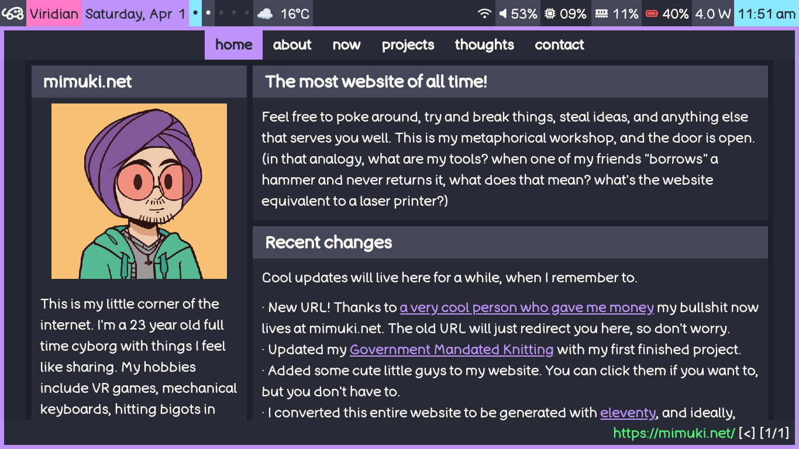

# dotfiles
All the things you need if you're me. Works by using [Chezmoi](https://github.com/twpayne/chezmoi). This [automatically installs some essential + useful programs](https://github.com/mimuki/dotfiles/blob/main/run_onchange_install-packages.sh), as well as my personal configurations of them. If you're not me, good luck- it's all bespoke to my weird accessibility needs and personal tastes.

# How to use
` sh -c "$(curl -fsLS get.chezmoi.io)" -- init --apply mimuki` installs chezmoi + my config onto a new machine. `chezmoi update` to get the latest changes from github. `chezmoi apply` to apply any local changes to your actual dotfiles. Anything else you need to know should be in the [chezmoi documentation](https://www.chezmoi.io/quick-start/#next-steps).

## Currently included:
- [awesomeWM, a tiling window manager](https://github.com/awesomeWM/awesome)
- [discordo, a terminal discord client](https://github.com/ayn2op/discordo)
- [Dracula, a GTK theme](https://github.com/dracula/gtk)
- [git, a version control system](https://github.com/git/git)
- [keynav, a mouse replacement](https://github.com/jordansissel/keynav)
- [kitty, a terminal](https://github.com/kovidgoyal/kitty)
- [lxappearance, a GTK theme switcher](https://github.com/lxde/lxappearance)
- [picom, a compositor](https://github.com/yshui/picom)
- [qutebrowser, a browser](https://github.com/qutebrowser/qutebrowser)
- [rofi, a window switcher, application launcher, and more](https://github.com/davatorium/rofi)
- [vim, a text editor](https://github.com/vim/vim)

- [Autostarting programs on login](https://github.com/mimuki/dotfiles/blob/main/dot_xprofile.tmpl)
- [Custom fonts](https://github.com/mimuki/dotfiles/tree/main/dot_fonts)

## Examples

